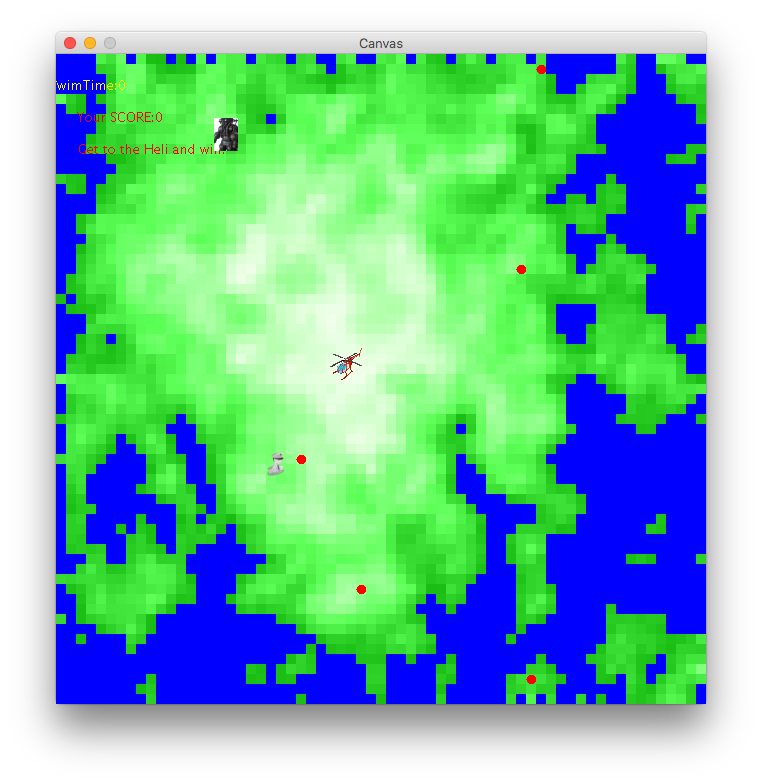

# ForbiddenIsland
CS2510 Fundamentals of Computer Science II (Summer 2016): Project 1

**Collaborators**: Yangsoo Song, Thomas Harmon

**Course Website**: https://course.ccs.neu.edu/cs2510/

## Introduction
Forbidden Island is a game in which you are a pilot trying to escape an island
that is quickly flooding. In order to escape, you must collect all five targets
and get to the helicopter before the island is completely submerged.

## Controls
You control the pilot by using the arrow keys. You can only stand on land-- not
flooded or ocean-- cells. You collect targets and enter the helicopter by
standing on the same cell as the target or helicopter, respectively. You cannot
enter the helicopter until you have collected all five targets.

## Maps
Land cells range from green to white, where the whitest cell is the peak.
Flooded cells range from blue to black, where black indicates that the cell is
quite submerged. Ocean cells are blue. Land and flooded cells change color on
each tick.

There are three different maps that you can play:

**Regular Mountain**
The center of the screen is the peak, and the height uniformly decreases as
you travel down the mountain, toward the corners.

**Random Mountain**
Although the mountain is still in a diamond shape, the heights are random.

**Random Terrain**
The shape and heights are random.

## How to Change Maps
In the default constructor of `ForbiddenIslandWorld`, change the map by calling
`createRegularMountain()` for the Regular Mountain, `createRandomMountain()` for the
Random Mountain, or `createRandomTerrain()` for the Random Terrain.

## Gameplay
You win once you have collected all five targets and have made it to the
helicopter. The win screen will be displayed as follows:

You will lose if:
- The cell that you, the helicopter, or any of the targets is on floods.
- All possible paths to any of the targets or the helicopter floods.

Although these scenarios indicate an unsuccessful game, the game does not 
officially end until the cell that you are on floods. Thus, sometimes you 
have to wait for this to happen if there is nothing else that you can do. 

The lose screen will be displayed as follows:

## How to Run the Game
1. Download Eclipse: https://www.eclipse.org/ide/
2. Pull this repository and set [`EclipseWorkspace`](/EclipseWorkspace) as
the workspace, or import [`ForbiddenIsland`](/EclipseWorkspace/ForbiddenIsland)
into the workspace
3. Import the two external `.jar` files in [`EclipseJars`](/EclipseJars) into the
build path
4. In the run configurations, set the main class as `tester.Main` and the
program arguments as `Examples`
5. Run the program
